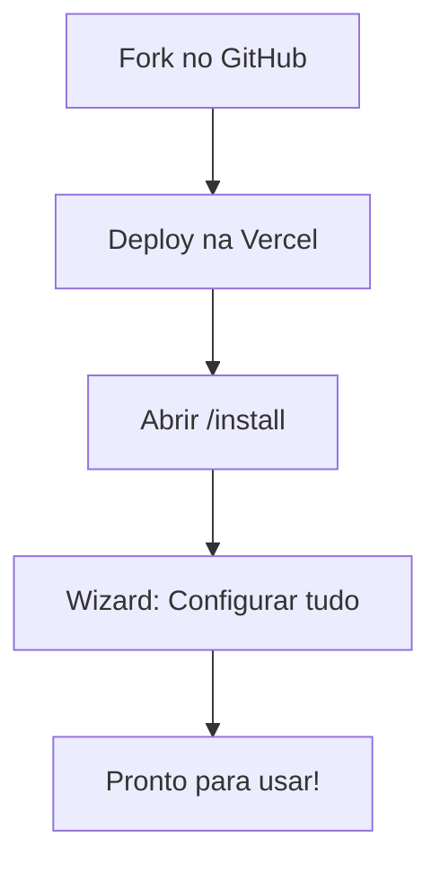

# NossoCRM

> CRM inteligente com assistente de IA integrado. Gerencie seu pipeline de vendas, contatos e atividades de forma visual e produtiva.

---

## 📋 Índice

- [Sobre](#-sobre)
- [O que você pode fazer](#-o-que-você-pode-fazer)
- [Instalação Rápida](#-instalação-rápida)
- [Primeiros Passos](#-primeiros-passos)
- [Como Usar](#-como-usar)
- [Configurações](#-configurações)
- [Problemas Comuns](#-problemas-comuns)
- [Suporte](#-suporte)

---

## 🎯 Sobre

**NossoCRM** é uma plataforma completa de gestão de relacionamento com clientes (CRM) que ajuda equipes de vendas a serem mais produtivas e organizadas.

### Por que escolher NossoCRM?

- 🚀 **Instalação em minutos**: Deploy automático na Vercel + wizard que configura tudo
- 🤖 **Assistente de IA**: Converse com seu CRM e peça análises, crie deals, gere scripts de vendas
- 📊 **Pipeline Visual**: Veja suas oportunidades em formato Kanban, arraste e organize facilmente
- 👥 **Gestão de Contatos**: Organize clientes, empresas e leads em um só lugar
- 📧 **Inbox Inteligente**: Receba briefing diário gerado por IA com suas prioridades
- 🔐 **Seguro**: Cada organização tem seus dados isolados e protegidos
- 📱 **Funciona em qualquer dispositivo**: Acesse pelo navegador ou instale como app

---

## ✨ O que você pode fazer

### 📋 Pipeline de Vendas
- Visualize todas suas oportunidades em um quadro Kanban
- Arraste deals entre estágios (prospecção, negociação, fechamento)
- Veja métricas em tempo real (valor total, probabilidade, tempo parado)
- Organize por prioridade, responsável ou tags

### 👥 Contatos e Empresas
- Cadastre contatos com todas as informações importantes
- Organize por estágios do funil (lead, prospect, cliente)
- Importe contatos de planilhas CSV
- Exporte dados quando precisar

### 💼 Oportunidades (Deals)
- Crie oportunidades vinculadas a contatos
- Adicione produtos e serviços
- Configure campos personalizados
- Acompanhe probabilidade de fechamento

### 📅 Atividades
- Crie tarefas e lembretes
- Agende reuniões e chamadas
- Veja tudo que precisa fazer hoje
- Complete atividades diretamente do CRM

### 🤖 Assistente de IA
- **Pergunte sobre seu pipeline**: "Mostre deals parados há mais de 10 dias"
- **Peça análises**: "Analise o pipeline e me dê insights"
- **Crie oportunidades**: "Crie um deal para o contato João Silva, valor R$ 50.000"
- **Gere scripts**: Peça scripts de vendas personalizados
- **Rascunhos de email**: Crie emails comerciais com ajuda da IA

### 📧 Inbox Inteligente
- Receba briefing diário com suas prioridades
- Acesse scripts de vendas prontos
- Veja atividades focadas por oportunidade
- Organize seu dia de forma eficiente

### 🔔 Integrações
- **Webhooks**: Conecte com outras ferramentas (Hotmart, n8n, Make)
- **API**: Integre com seus sistemas existentes
- **Importação**: Traga dados de planilhas

---

## 🚀 Instalação Rápida

> ⚡ **Tempo estimado**: 15-20 minutos  
> 🎯 **Método recomendado**: Fork → Vercel → Wizard

Este guia vai te levar do zero até ter seu CRM funcionando em produção. Não precisa saber programar!

### O que você vai fazer

1. ✅ Fazer fork do repositório no GitHub
2. ✅ Fazer deploy na Vercel (automático)
3. ✅ Rodar o wizard de instalação
4. ✅ Começar a usar!



---

### Pré-requisitos

Antes de começar, você precisa de contas gratuitas nestes serviços:

| Serviço | Para quê | Link |
|---------|----------|------|
| **GitHub** | Código do projeto | [github.com](https://github.com) |
| **Vercel** | Hospedagem e deploy | [vercel.com](https://vercel.com) |
| **Supabase** | Banco de dados | [supabase.com](https://supabase.com) |

> 💡 **Dica**: Crie as contas antes de começar e deixe-as abertas em abas diferentes.

---

### Passo 1: Fork no GitHub

O primeiro passo é fazer uma cópia do projeto no seu GitHub:

1. Acesse o repositório: [github.com/thaleslaray/nossocrm](https://github.com/thaleslaray/nossocrm)
2. Clique no botão **Fork** (canto superior direito)
3. Escolha sua conta pessoal ou organização
4. Aguarde o fork ser criado

> ✅ **Pronto quando**: Você ver o repositório `nossocrm` na sua conta do GitHub

<details>
<summary><strong>Como fazer fork (com imagens)</strong></summary>

1. Na página do repositório, clique em **Fork**
   

2. Escolha onde fazer o fork
   

3. Aguarde a criação
   

</details>

---

### Passo 2: Deploy na Vercel

Agora vamos colocar o projeto no ar usando a Vercel:

1. Acesse [vercel.com](https://vercel.com) e faça login
2. Clique em **Add New Project** (ou **New Project**)
3. Conecte sua conta do GitHub (se ainda não conectou)
4. Na lista de repositórios, encontre e selecione **nossocrm** (seu fork)
5. Clique em **Deploy**

> ⏱️ **Aguarde**: O deploy leva cerca de 2-3 minutos

6. Quando terminar, você verá uma mensagem de sucesso
7. **Copie a URL** do seu projeto (ex: `https://nossocrm-abc123.vercel.app`)

> ✅ **Pronto quando**: Você tiver uma URL funcionando (pode estar sem configuração ainda, é normal!)

<details>
<summary><strong>Como fazer deploy na Vercel (passo a passo)</strong></summary>

1. **Add New Project**
   - Na dashboard da Vercel, clique em "Add New" → "Project"

2. **Importar repositório**
   - Selecione seu fork do `nossocrm`
   - Se não aparecer, clique em "Adjust GitHub App Permissions" e dê permissão

3. **Configurações do projeto**
   - Framework Preset: Next.js (detectado automaticamente)
   - Root Directory: `./` (deixe padrão)
   - Build Command: `npm run build` (já vem preenchido)
   - Output Directory: `.next` (já vem preenchido)

4. **Deploy**
   - Clique em "Deploy"
   - Aguarde o build terminar

5. **Sucesso!**
   - Você verá "Congratulations! Your deployment has been created"
   - Copie a URL do projeto

</details>

---

### Passo 3: Rodar o Wizard de Instalação

Agora vamos configurar tudo usando o wizard automatizado:

1. **Acesse o wizard**
   - Abra a URL do seu projeto: `https://SEU-PROJETO.vercel.app/install`
   - Você será redirecionado para `/install/start`

2. **Prepare suas credenciais**

   Você vai precisar de:
   
   **a) Token da Vercel:**
   - Vá em Vercel → Settings → Tokens
   - Clique em "Create Token"
   - Dê um nome (ex: "NossoCRM Installer")
   - Copie o token (aparece só uma vez!)

   **b) Credenciais do Supabase:**
   
   *Opção 1: Criar projeto novo (recomendado)*
   - Vá em [supabase.com](https://supabase.com) → New Project
   - Escolha um nome e senha do banco
   - Aguarde a criação (2-3 minutos)
   - Vá em Settings → API
   - Copie: Project URL, anon key, service_role key
   - Vá em Settings → Database → Connection string
   - Copie a connection string (Transaction pooler, porta 6543)

   *Opção 2: Usar projeto existente*
   - Vá em Settings → API
   - Copie as mesmas informações acima

3. **Preencha o wizard**

   No wizard (`/install/start`), você vai informar:
   
   - ✅ Token da Vercel
   - ✅ URL do projeto Supabase
   - ✅ Chaves do Supabase (anon + service_role)
   - ✅ Connection string do banco (para migrations automáticas)
   - ✅ Email e senha do administrador

4. **Aguarde a instalação**

   O wizard vai:
   - ✅ Criar projeto no Supabase (se necessário)
   - ✅ Aplicar migrations no banco
   - ✅ Configurar variáveis de ambiente na Vercel
   - ✅ Criar usuário administrador
   - ✅ Fazer redeploy automático

   ⏱️ **Tempo**: 3-5 minutos

5. **Pronto!**

   Quando terminar, você será redirecionado para fazer login.

> ✅ **Pronto quando**: Você conseguir fazer login com o email e senha que configurou!

---

### Passo 4: Validar Instalação

Para garantir que tudo está funcionando:

1. **Faça login** com suas credenciais
2. **Acesse o Dashboard** - deve carregar normalmente
3. **Teste criar um contato** - vá em Contatos → Novo Contato
4. **Teste o assistente de IA** - clique no ícone de IA e faça uma pergunta

Se tudo funcionar, sua instalação está completa! 🎉

---

## 🎬 Primeiros Passos

### 1. Fazer login

Após a instalação, acesse o sistema e faça login com:
- **Email**: O email que você configurou no wizard
- **Senha**: A senha que você definiu

### 2. Configurar sua organização

Na primeira vez, você precisará:
- Definir o nome da sua organização
- Escolher configurações iniciais

### 3. Criar seu primeiro pipeline

1. Vá em **Boards** ou **Pipeline**
2. Clique em **Criar Board**
3. Escolha um template ou crie do zero
4. Defina os estágios do seu funil (ex: Prospecção, Qualificação, Proposta, Negociação, Fechado)

### 4. Adicionar contatos

1. Vá em **Contatos**
2. Clique em **Novo Contato**
3. Preencha as informações básicas
4. Escolha o estágio do funil

### 5. Criar sua primeira oportunidade

1. Vá em **Pipeline**
2. Clique em **Novo Deal**
3. Escolha o contato
4. Defina valor e estágio inicial
5. Salve!

### 6. Testar o assistente de IA

1. Clique no ícone de IA (geralmente no canto da tela)
2. Faça uma pergunta como: "Mostre todos os deals"
3. Veja a mágica acontecer! ✨

---

## 💻 Como Usar

### Navegação Principal

O NossoCRM tem estas áreas principais:

- **📊 Dashboard**: Visão geral com métricas e gráficos
- **📋 Pipeline**: Visualização Kanban das oportunidades
- **👥 Contatos**: Lista de contatos e empresas
- **📅 Atividades**: Tarefas e compromissos
- **📧 Inbox**: Briefing diário e scripts
- **⚙️ Configurações**: Ajustes do sistema

### Dicas de Produtividade

#### Use o Assistente de IA

O assistente pode fazer muito por você:

```
Você: "Crie um deal para Maria Silva, empresa TechCorp, valor R$ 30.000"
IA: ✅ Deal criado! "Negócio com TechCorp" no estágio "Prospecção"

Você: "Quais deals estão parados há mais de 10 dias?"
IA: Encontrei 3 deals parados:
    - Negócio ABC (15 dias)
    - Negócio XYZ (12 dias)
    ...

Você: "Analise o pipeline e me dê insights"
IA: 📊 Análise do seu pipeline:
    - Valor total: R$ 250.000
    - 5 deals em negociação
    - 2 deals precisam de atenção (parados)
    ...
```

#### Organize com Tags

Use tags para categorizar seus deals:
- `hot-lead` para leads quentes
- `follow-up` para precisar retornar
- `proposta-enviada` para propostas em análise

#### Use Campos Personalizados

Configure campos específicos para seu negócio:
- Tipo de produto
- Origem do lead
- Vendedor responsável
- Qualquer informação importante

### Importar Dados

Se você já tem dados em planilhas:

1. Vá em **Contatos**
2. Clique em **Importar**
3. Escolha o arquivo CSV
4. Mapeie as colunas
5. Importe!

---

## ⚙️ Configurações

### Configurar Inteligência Artificial

Para usar o assistente de IA, você precisa configurar uma chave de API:

1. Vá em **Configurações → Central de I.A.**
2. Escolha um provedor:
   - **Google Gemini** (recomendado para começar)
   - **OpenAI** (GPT-4)
   - **Anthropic** (Claude)
3. Cole sua chave de API
4. Escolha o modelo
5. Ative "IA ativa na organização"

> 💡 **Onde conseguir chaves?**
> - Google Gemini: [Google AI Studio](https://makersuite.google.com/app/apikey)
> - OpenAI: [platform.openai.com](https://platform.openai.com/api-keys)
> - Anthropic: [console.anthropic.com](https://console.anthropic.com/)

### Configurar Permissões

O NossoCRM tem dois tipos de usuários:

- **👑 Administrador**: Pode tudo (configurações, usuários, etc.)
- **👤 Vendedor**: Pode usar o CRM normalmente, mas não altera configurações

Para adicionar usuários:
1. Vá em **Configurações → Equipe**
2. Clique em **Convidar Usuário**
3. Escolha o papel (admin ou vendedor)
4. Envie o convite

### Configurar Webhooks

Webhooks permitem automatizar tarefas:

**Entrada de Leads** (inbound):
- Configure para receber leads automaticamente
- Útil para conectar com Hotmart, formulários, etc.

**Follow-up** (outbound):
- Configure para avisar quando um lead muda de estágio
- Útil para conectar com WhatsApp, email marketing, etc.

Veja o guia completo em: [docs/webhooks.md](./docs/webhooks.md)

---

## 🔧 Problemas Comuns

### Não consigo fazer login

**Possíveis causas:**
- Email ou senha incorretos
- Conta não foi criada corretamente no wizard

**Solução:**
- Verifique se você completou a instalação via wizard
- Confirme que usou o email e senha que configurou
- Tente recuperar senha (se disponível)
- Entre em contato com o suporte

### Wizard não funciona

**Possíveis causas:**
- Token da Vercel inválido ou expirado
- Credenciais do Supabase incorretas
- Problema de conexão

**Solução:**
- Verifique se o token da Vercel está correto e ativo
- Confirme as credenciais do Supabase (URL, keys)
- Certifique-se de estar usando a URL de **Production** (não Preview)
- Tente novamente em alguns instantes

### Assistente de IA não funciona

**Possíveis causas:**
- Chave de API não configurada
- IA desabilitada na organização
- Chave inválida ou sem créditos

**Solução:**
1. Vá em **Configurações → Central de I.A.**
2. Verifique se a chave está preenchida
3. Confirme que "IA ativa" está habilitado
4. Teste com uma chave diferente se necessário

### Dados não aparecem

**Possíveis causas:**
- Filtros ativos
- Permissões insuficientes
- Problema de conexão

**Solução:**
- Verifique os filtros na página
- Confirme que você tem permissão para ver os dados
- Recarregue a página (F5)
- Limpe o cache do navegador

### Erro ao criar deal/contato

**Possíveis causas:**
- Campos obrigatórios não preenchidos
- Problema de conexão
- Limite de dados atingido

**Solução:**
- Verifique se todos os campos obrigatórios estão preenchidos
- Confirme sua conexão com internet
- Tente novamente em alguns instantes

### Página não carrega

**Possíveis causas:**
- Problema de conexão
- Servidor em manutenção
- Cache do navegador

**Solução:**
- Verifique sua conexão com internet
- Limpe o cache do navegador (Ctrl+Shift+Delete)
- Tente em modo anônimo
- Entre em contato com o suporte se persistir

---

## 📞 Suporte

### Documentação

- **[Guia de Webhooks](./docs/webhooks.md)**: Como configurar automações
- **[Permissões](./docs/security/RBAC.md)**: Entenda admin vs vendedor
- **[API Pública](./docs/public-api.md)**: Documentação para desenvolvedores

### Contato

- 🐛 **Problemas**: Abra uma [issue no GitHub](https://github.com/thaleslaray/nossocrm/issues)
- 💬 **Dúvidas**: Entre em contato com o mantenedor
- 📖 **Documentação completa**: Veja a pasta `docs/`

---

## 🛠️ Para Desenvolvedores

> Esta seção é apenas para quem quer contribuir ou entender a arquitetura técnica.

### Stack Tecnológica

- **Frontend**: Next.js 16 + React 19 + TypeScript
- **Backend**: Next.js API Routes
- **Banco de Dados**: Supabase (PostgreSQL)
- **Autenticação**: Supabase Auth
- **IA**: AI SDK v6 (Google Gemini, OpenAI, Anthropic)
- **UI**: Radix UI + Tailwind CSS

### Instalação para Desenvolvimento

Se você quer desenvolver ou contribuir:

```bash
# 1. Clone o repositório
git clone https://github.com/thaleslaray/nossocrm.git
cd nossocrm

# 2. Instale dependências
npm install

# 3. Configure variáveis de ambiente
# Copie .env.example para .env.local e preencha

# 4. Inicie o servidor
npm run dev
```

### Scripts Disponíveis

```bash
npm run dev          # Desenvolvimento
npm run build        # Build de produção
npm run start        # Servidor de produção
npm run lint         # Verificar código
npm run typecheck    # Verificar tipos
npm test             # Rodar testes
```

### Estrutura do Projeto

```
nossocrm/
├── app/              # Rotas Next.js
├── features/         # Módulos por domínio
├── components/       # Componentes compartilhados
├── lib/              # Bibliotecas e utilitários
├── context/          # Contextos React
└── docs/             # Documentação
```

Para mais detalhes técnicos, veja:
- [AGENTS.md](./AGENTS.md) - Guia para desenvolvedores
- [CODEBASE_ANALYSIS.md](./CODEBASE_ANALYSIS.md) - Análise técnica

---

## 📄 Licença

Este projeto é privado e proprietário. Todos os direitos reservados.

---

## 👥 Autores

- **Thales Laray** - *Desenvolvimento inicial e manutenção*

---

<div align="center">

**[⬆ Voltar ao topo](#nosso-crm)**

Feito com ❤️ para equipes de vendas mais produtivas

</div>
